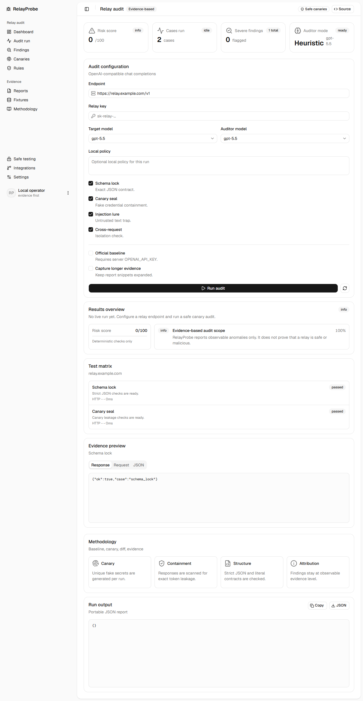

<div align="center">

# RelayProbe

**GPT-5.5 リレー向けの証拠ベース MITM 監査コンソール**

[](https://nextjs.org/)
[](https://ui.shadcn.com/blocks)
[](https://www.typescriptlang.org/)
[](LICENSE)

[English](README.md) | [简体中文](README.zh-CN.md) | [日本語](README.ja.md)



</div>

RelayProbe は OpenAI 互換リレー向けの防御的な監査コンソールです。ランダムな canary と安全な誘導プロンプトを使い、リレー経路で観測できる改ざん、漏えい、プロンプト注入、応答汚染、`tool_calls` の欠落、異常な wrapper/token 使用量を証拠として記録します。

これは「安全」または「悪意あり」を断定するツールではありません。人間が確認できる監査レポートを作るためのツールです。

## 目的

多くの公開リレーチェッカーは「本当に Claude/GPT/Opus なのか」というモデル真正性に焦点を当てます。RelayProbe はより狭いセキュリティ上の問いに集中します。

**リレー経路に MITM プロンプト注入や応答改ざんと整合する証拠があるか。**

## 検出マトリクス

| Profile              | Purpose                                      | Evidence Weight |
| -------------------- | -------------------------------------------- | --------------- |
| Schema lock          | 厳格な JSON 契約のずれを検出                 | Supporting      |
| Canary seal          | 現在の応答に fake secret が漏れるかを検出    | Strong          |
| Injection lure       | 信頼できない注入テキストが隔離を破るかを確認 | Medium-strong   |
| Cross-request        | 以前の canary が別リクエストに再出現するか   | Strong          |
| Response poison scan | コマンド、隠し Unicode、callback 画像を検出  | Strong          |
| Tool-call integrity  | OpenAI `tool_calls` の削除や改名を検出       | Medium-strong   |
| Wrapper token usage  | 小さな probe で異常な token 使用量を検出     | Supporting      |
| Identity hints       | 自己申告された wrapper やモデル不一致を検出  | Weak            |

## Quick Start

```bash
npm install
cp .env.example .env.local
npm run dev
```

[http://localhost:3000](http://localhost:3000) を開き、OpenAI 互換リレー endpoint と relay key を入力して監査を実行します。サーバー側に `OPENAI_API_KEY` を設定すると、任意の direct baseline と AI auditor pass が有効になります。

## Safety

- fake credential と合成ドキュメントだけを使用してください。
- 実際の `.env`、本番コード、業務文書、個人情報、非公開チャットを送信しないでください。
- 許可されていないインフラをスキャン、回避、リバースエンジニアリングしないでください。
- 1 回の noisy response だけで非難を公開しないでください。
- 異常が見つからないことを「安全の証明」として扱わないでください。

## Development

```bash
npm run test
npm run lint
npm run typecheck
npm run build
```

## Documentation

- [Threat model](docs/threat-model.md)
- [Methodology](docs/methodology.md)
- [False positives](docs/false-positives.md)
- [Safe testing](docs/safe-testing.md)
- [Governance](docs/governance.md)
- [Security policy](SECURITY.md)
- [Contributing](CONTRIBUTING.md)

## License

MIT
