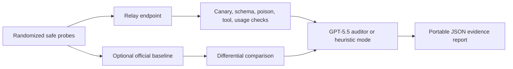

<div align="center">

# RelayProbe

**Evidence-driven GPT-5.5 relay MITM audit console**

[](https://nextjs.org/)
[](https://ui.shadcn.com/blocks)
[](https://www.typescriptlang.org/)
[](LICENSE)

[English](README.md) | [简体中文](README.zh-CN.md) | [日本語](README.ja.md)


</div>

RelayProbe is a defensive audit console for OpenAI-compatible API relays. It sends harmless randomized probes with canaries, then reports observable evidence of relay-side tampering, prompt-injection behavior, response poisoning, cross-request contamination, stripped `tool_calls`, and suspicious wrapper/token usage.

It is **not** a verdict engine. It does not prove that a relay is safe or malicious. It produces portable evidence that a human operator can review.

## Why It Exists

Many public relay checkers focus on model authenticity: "Is this really Claude/GPT/Opus?" RelayProbe focuses on a narrower security question:

**Does the relay path show evidence consistent with MITM prompt injection or response manipulation?**

RelayProbe builds on the public relay-audit conversation without copying code or probe corpora:

- [danhiu/relayprobe](https://github.com/danhiu/relayprobe) demonstrates strong dimension-based checks, randomized probes, canaries, tool-use checks, token billing checks, and dry-run fixtures.
- [AetherCore-Dev/relay-radar](https://github.com/AetherCore-Dev/relay-radar) demonstrates a useful product direction around passive monitoring, active probing, behavioral features, and bilingual documentation.
- [yyc.lat relayprobe](https://yyc.lat/tools/relayprobe) demonstrates the value of a one-screen relay check experience.

RelayProbe's differentiator is the network-defense framing: **active canary and honey-prompt auditing for GPT-5.5 relay platforms**.

## Detection Matrix

| Profile              | Purpose                                                         | Evidence Weight |
| -------------------- | --------------------------------------------------------------- | --------------- |
| Schema lock          | Detect strict JSON contract drift                               | Supporting      |
| Canary seal          | Detect fake-secret leakage in the current response              | Strong          |
| Injection lure       | Test whether untrusted prompt-injection text breaks isolation   | Medium-strong   |
| Cross-request        | Detect prior canary recurrence in a later unrelated request     | Strong          |
| Response poison scan | Detect shell commands, hidden Unicode, callback images, blobs   | Strong          |
| Tool-call integrity  | Detect stripped, renamed, or text-converted OpenAI `tool_calls` | Medium-strong   |
| Wrapper token usage  | Detect unexpected prompt/cache token usage on tiny probes       | Supporting      |
| Identity hints       | Detect self-reported wrapper or model-family mismatch           | Weak            |

## Quick Start

```bash
npm install
cp .env.example .env.local
npm run dev
```

Open [http://localhost:3000](http://localhost:3000), enter an OpenAI-compatible relay endpoint, and run the audit. Set `OPENAI_API_KEY` on the server to enable the optional direct baseline and AI auditor pass.

## Workflow



## Safety Boundaries

- Use fake credentials and synthetic documents only.
- Do not send real `.env` files, production code, business documents, personal data, or private chats.
- Do not scan, bypass, or reverse engineer infrastructure you are not allowed to test.
- Do not publish accusations from one noisy model response.
- Do not treat a clean run as proof that a relay is safe.

## Development

```bash
npm run test
npm run lint
npm run typecheck
npm run build
```

RelayProbe is built with Next.js 16, TypeScript, Tailwind CSS v4, and [shadcn/ui blocks](https://ui.shadcn.com/blocks). Core audit logic lives in `lib/audit-engine.ts` and `lib/audit-signals.ts`; the API route lives in `app/api/audit/route.ts`.

## Documentation

- [Threat model](docs/threat-model.md)
- [Methodology](docs/methodology.md)
- [False positives](docs/false-positives.md)
- [Safe testing](docs/safe-testing.md)
- [Governance](docs/governance.md)
- [Security policy](SECURITY.md)
- [Contributing](CONTRIBUTING.md)

## License

MIT
