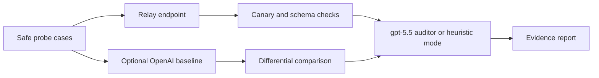

# RelayProbe

Audit OpenAI-compatible relays for observable tampering, injection, and canary leakage evidence.

> Evidence-based auditing, not a guarantee of safety. RelayProbe surfaces anomalies that require human interpretation.


## Why

Third-party API relays can see most prompt and response data that passes through them. RelayProbe does not try to reverse engineer a relay. It sends controlled, harmless probes and reports whether the observed behavior is consistent with:

- request or response mutation
- hidden prompt injection or extra middleware text
- fake-secret canary leakage
- cross-request contamination
- OpenAI-compatible protocol drift
- suspicious differences from an optional direct baseline

## What It Does Not Prove

RelayProbe cannot prove that a relay never stores data, never forwards data, or is operated with good intent. It also cannot replace a formal penetration test, legal review, or provider-side audit. Its output is a structured evidence report, not a verdict.

## Quick Start

```bash
npm install
cp .env.example .env.local
npm run dev
```

Open http://localhost:3000 and enter an OpenAI-compatible relay endpoint plus a relay key. Keep `OPENAI_API_KEY` on the server if you want the optional direct baseline and the `gpt-5.5` auditor pass.

## How It Works



RelayProbe sends randomized safe probes, including strict JSON contracts, fake-secret canaries, untrusted-document injection lures, and cross-request isolation checks. The server route performs deterministic checks first. If `OPENAI_API_KEY` is present, it asks `gpt-5.5` to review the captured evidence with a conservative auditor prompt.

## Sample Finding

```json
{
  "severity": "high",
  "confidence": 92,
  "category": "canary",
  "title": "Canary appeared in response",
  "evidence": "Canary seal response contained sk-canary-seal-...",
  "recommendation": "Do not send private prompts or credentials through this relay without additional controls."
}
```

## Safety Rules

- Use fake secrets only.
- Do not test with real API keys, private prompts, production documents, or personal data.
- Do not scan infrastructure you do not control.
- Do not treat model style differences as proof of relay tampering.
- Prefer HTTPS endpoints. Remote plain HTTP endpoints are rejected by default.

## Documentation

- [Threat model](docs/threat-model.md)
- [Methodology](docs/methodology.md)
- [False positives](docs/false-positives.md)
- [Safe testing](docs/safe-testing.md)

## Development

```bash
npm run lint
npm run typecheck
npm run build
```

RelayProbe is built with Next.js, TypeScript, Tailwind CSS v4, and shadcn/ui blocks.

## License

MIT
