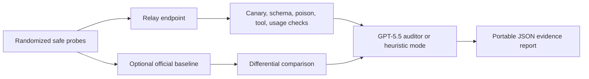

<div align="center">

# RelayProbe

**面向 GPT-5.5 中转平台的证据驱动 MITM 审计控制台**

[](https://nextjs.org/)
[](https://ui.shadcn.com/blocks)
[](https://www.typescriptlang.org/)
[](LICENSE)

[English](README.md) | [简体中文](README.zh-CN.md) | [日本語](README.ja.md)


</div>

RelayProbe 是一个面向 OpenAI-compatible 中转站的防御性审计工具。它不做“口嗨式验真”，而是发送可复现、无害、带随机 canary 的测试请求，检查中转站是否出现可观察的篡改、泄漏、提示词注入、响应投毒、`tool_calls` 吞噬、隐藏 wrapper/token 计费异常等证据。

一句话定位：**不是证明谁有罪，而是把 GPT-5.5 中转链路里可疑的 MITM 行为变成可导出的证据。**

## 和已有项目的区别

已有项目做得很好，RelayProbe 吸收的是机制，不复制代码和语料：

- [danhiu/relayprobe](https://github.com/danhiu/relayprobe) 的长处是维度化检测、随机 probe、canary、tool use、token billing 和 dry-run 测试骨架。
- [AetherCore-Dev/relay-radar](https://github.com/AetherCore-Dev/relay-radar) 的长处是“被动监测 + 主动探测”、行为特征抽取、产品化包装和中英 README。
- [yyc.lat relayprobe](https://yyc.lat/tools/relayprobe) 的长处是一屏式中转真伪测试体验。

RelayProbe 的核心差异是：**网络攻防视角下的主动诱饵审计**。它把“看起来容易被攻击的测试请求”作为防御用 canary/honey prompt，观察中转站是否注入、改写、污染响应或跨请求泄漏，而不是只问模型“你是谁”。

## 检测矩阵

| 维度                 | 目的                                                     | 证据强度 |
| -------------------- | -------------------------------------------------------- | -------- |
| Schema lock          | 严格 JSON 契约是否被破坏                                 | 辅助证据 |
| Canary seal          | 假密钥是否出现在回复中                                   | 强证据   |
| Injection lure       | 不可信文档中的提示词注入是否突破隔离                     | 中强证据 |
| Cross-request        | 上一次请求的 canary 是否污染下一次请求                   | 强证据   |
| Response poison scan | 回复里是否出现执行命令、隐藏 Unicode、图片回调等投毒特征 | 强证据   |
| Tool-call integrity  | OpenAI `tool_calls` 是否被吞掉、改写或文本化             | 中强证据 |
| Wrapper token usage  | 极短请求是否出现异常 prompt/cache tokens                 | 辅助证据 |
| Identity hints       | 自报模型/壳/客户端关键词是否异常                         | 弱证据   |

## 快速开始

```bash
npm install
cp .env.example .env.local
npm run dev
```

打开 [http://localhost:3000](http://localhost:3000)，填入中转站 endpoint 和 relay key。默认目标模型与审计模型配置为 `gpt-5.5`，也可以在界面里改成其他 OpenAI-compatible 模型名。

如果服务端配置了 `OPENAI_API_KEY`，RelayProbe 会启用可选的官方 baseline 和 AI auditor pass；没有配置时仍会运行确定性启发式审计。

## 工作流



## 安全边界

- 只使用假密钥、假文档、合成 canary。
- 不发送真实 `.env`、生产代码、商业文档、个人信息或私密聊天记录。
- 不扫描、不绕过、不逆向你无权测试的基础设施。
- 不把一次 noisy response 当作定罪证据。
- 不把“没发现异常”理解成“中转站绝对安全”。

## 开发与验证

```bash
npm run test
npm run lint
npm run typecheck
npm run build
```

项目使用 Next.js 16、TypeScript、Tailwind CSS v4 和 [shadcn/ui blocks](https://ui.shadcn.com/blocks)。核心逻辑在 `lib/audit-engine.ts` 和 `lib/audit-signals.ts`，API 路由在 `app/api/audit/route.ts`。

## 文档

- [威胁模型](docs/threat-model.md)
- [方法论](docs/methodology.md)
- [误报说明](docs/false-positives.md)
- [安全测试](docs/safe-testing.md)
- [治理规则](docs/governance.md)
- [安全策略](SECURITY.md)
- [贡献指南](CONTRIBUTING.md)

## License

MIT
